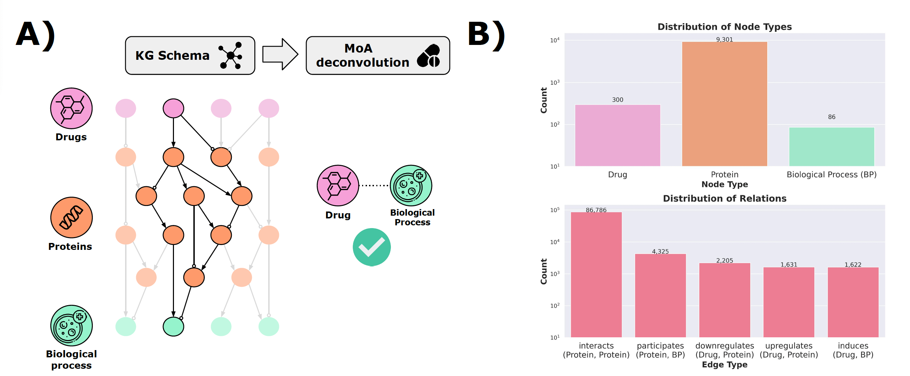

<h1 align="center">
Mechanism-of-Action Network (MoA-Net)
<br>

[]()

[](https://img.shields.io/badge/python-%3E%3D3.8-brightgreen)

</h1>


This is the code repository for the creation of *MoA-Net* and all of its variants. The network can be used for benchmarking purposes for interpretable drug discovery approaches.

*MoA-Net* can be used by graph based algorithms for MoA deconvolution. The figure below shows: A) the graph schema or data model of *MoA-Net* and B) the node and edge statistics of *MoA-Net*.



# Table of Content
* [Creation](#creation)
* [Downloading](#download)
* [Data relevant for MARS](#data)


<a name="creation"></a>
## Creation

To create MoA-net from scratch, the user can run each of the notebook in the [folder](notebooks):

0. [Preprocessing](notebooks/0_preprocessing.ipynb) - It includes the code for processing and generating the basic network.

1. [Enrichment](notebooks/1_enrichment.ipynb) - It includes the code to enrich compound - biological process (BP) pairs in the data.

1. [Validation set](notebooks/2_validation_moas.ipynb) - It includes the code to identify validation MoAs from DrugMechDB. 

1. [Target class annotation](notebooks/3_uniprot_keywords.ipynb) - It includes the code to annotate and tag target classes to proteins in the enriched network.

1. [Data splitting](notebooks/4_train_test_splits.ipynb) - It includes the code to split the enriched network into test-train-dev datasets.

1. [Metapaths](notebooks/5_metapath_generation.ipynb) - It includes the code to generate metapath rules on the network node types required for neurosymbolic AI models.

    5  p. [Metapaths 2](notebooks/5_p_metapath_generation.ipynb) - It includes a variant code to generate metapath rules based on the protein target classes.

***NOTE**: Notebooks beginning with `00` denote some preliminary searches which are not necessary to run.*


<a name="download"></a>
## Download MoA-net

To download MoA-net, access the specific versions from the following folders:

- [`data/kg/splits/MoA-net/`](data/kg/splits/MoA-net/): The full, original MoA-net.
- [`data/kg/splits/MoA-net-permuted/`](data/kg/splits/MoA-net-permuted/): The full, permuted version MoA-net, based on [XSwap](https://pubmed.ncbi.nlm.nih.gov/38323677/).
- [`data/kg/splits/MoA-net-protclass/`](data/kg/splits/MoA-net-protclass/): The full version of MoA-net in which ~55% of the proteins have a protein subclass.

Within each of these folders, the following files can be found:

```
kg_directory/
    ├── train.tsv
    ├── dev.tsv
    ├── test.tsv
    ├── kg_with_train_smpls.tsv
    ├── kg_no_cmp_bp.tsv
    ├── MARS/
        ├── ...
```
- `train.tsv`: The compound -> BP training triples (60%).
- `dev.tsv`: The compound -> BP validation triples (20%).
- `test.tsv`: The compound -> BP test triples (20%).
- `kg_with_train_smpls.tsv`: The MoA-net KG with the training triples from `train.tsv` included.
- `kg_no_cmp_bp.tsv`: The MoA-net KG with *no compound -> BP triples*. Therefore, it excludes all triples from `train.tsv`, `dev.tsv`, and `test.tsv`.

## Data relevant for MARS

The `MARS/` directory contains files which are processed and ready for input into [MARS: **m**echanism-of-**a**ction **r**etrieval **s**ystem](https://github.com/laurendelong21/MARS). This code is contained within the other code repository.

In the `MoA-net` folder, a additional directory with [10k](data/kg/splits/MoA-net/10k/) is present which is created as a result of MARS' automatic trimming step.
